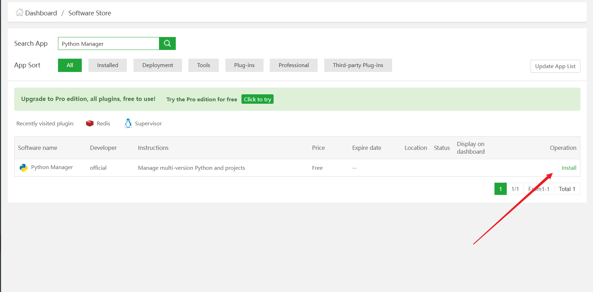
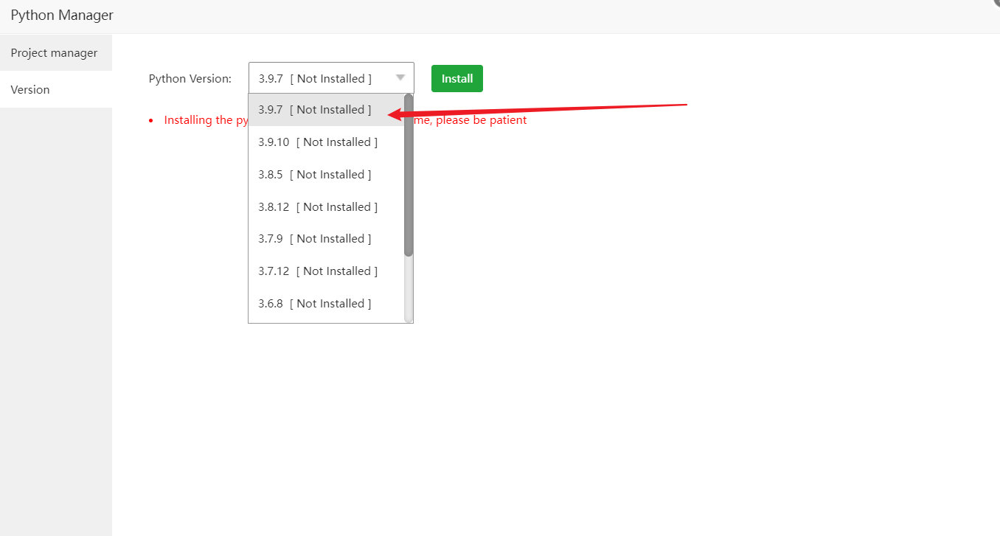
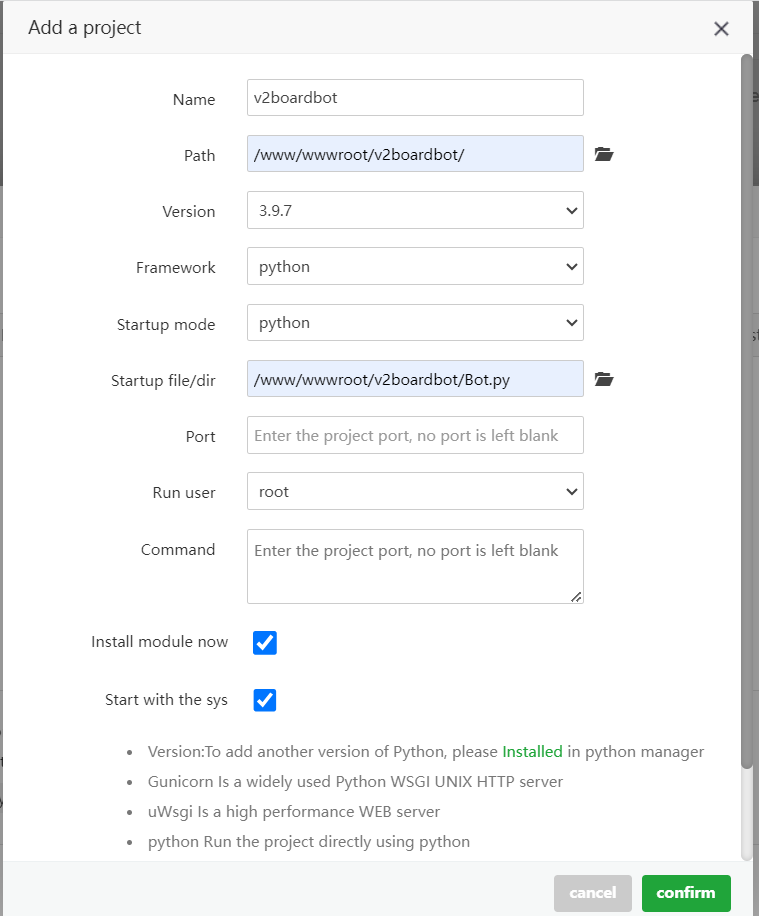
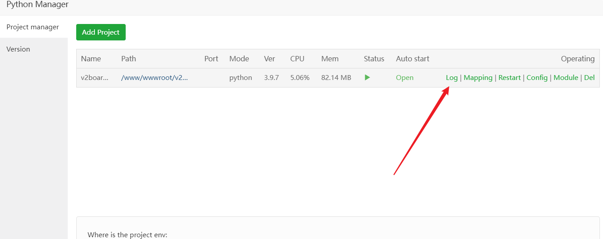

## 许可证

<p align="center">
<a rel="license" href="http://creativecommons.org/licenses/by-nc-sa/4.0/"></a><br /><span xmlns:dct="http://purl.org/dc/terms/" property="dct:title">v2boardbot</span> 由 <a xmlns:cc="http://creativecommons.org/ns#" href="https://github.com/v2boardbot/v2boardbot" property="cc:attributionName" rel="cc:attributionURL">v2boardbot</a> 采用 <a rel="license" href="http://creativecommons.org/licenses/by-nc-sa/4.0/">知识共享 署名-非商业性使用-相同方式共享 4.0 国际 许可协议</a>进行许可。<br />基于<a xmlns:dct="http://purl.org/dc/terms/" href="https://github.com/v2boardbot/v2boardbot" rel="dct:source">https://github.com/v2boardbot/v2boardbot</a>上的作品创作。
</p>


##### 声明: 由于还在测试阶段,数据库字段经常变化,可能随时删除重建


## 联系我们

邮箱地址：[zhuli8@protonmail.com](zhuli8@protonmail.com)

电报群组：[k2323Bot测试群](https://t.me/+LxVTX8H1Ca1mNDY1)

个人电报：[@k23223](https://t.me/k23223)

## 安装

### 当前ubuntu安装有问题，可以先用centos或者debian

#### 1.1克隆仓库

在你需要部署的机器上克隆本项目

如果在aaPanel面板上部署，推荐克隆到/www/wwwroot目录下

```bash
git clone https://github.com/v2boardbot/v2boardbot.git
```

#### 1.2 安装依赖

如果使用aaPanel面板上部署，不需要安装依赖

```bash
cd v2boardbot
pip install -r requirements.txt
```

#### 1.3 说明

该项目使用的依赖，主要就是python-telegram-bot和peewee版本对应一下即可

```python
aiomysql==0.2.0
anyio==3.7.1
asgiref==3.7.2
certifi==2023.7.22
charset-normalizer==3.2.0
databases==0.6.2
exceptiongroup==1.1.2
greenlet==2.0.2
h11==0.14.0
httpcore==0.17.3
httpx==0.24.1
idna==3.4
peewee==3.16.2
pydantic==1.10.8
PyMySQL==1.1.0
python-telegram-bot==20.4
PyYAML==6.0.1
requests==2.31.0
sniffio==1.3.0
socksio==1.0.0
SQLAlchemy==1.4.41
sqlparse==0.4.4
typing_extensions==4.7.1
tzdata==2023.3
urllib3==2.0.4
```

#### 机器人创建

请自行 [@BotFather](https://t.me/BotFather) 创建机器人，命令菜单如下

```text
start - 展开管理面板
bind - 绑定账号(仅限私聊)
unbind - 解除绑定
checkin - 每日签到
lucky - 幸运抽奖
wallet - 查看钱包
traffic - 查看流量
```

#### 机器人群组隐私设置

找[@BotFather](https://t.me/BotFather) 发送`/mybots` > 你的机器人 > Bot Settings > Group Privacy > Turn off

如果是Turn on就是禁用隐私设置了，不需要更改

老虎机等玩法依赖 Group Privacy ，如果 Group Privacy 为Turn off 将无法使用

#### 配置文件

按照示例填写自己的配置文件并保存为config.py,下面个人信息已脱敏处理

```python
DATABASE = {
    'database': '数据库名',
    'charset': 'utf8', 'sql_mode': 'PIPES_AS_CONCAT', 'use_unicode': True,
    'host': '数据库地址，如果和v2board部署在一起就填写127.0.0.1',
    'port': 3306,
    'user': '数据库用户名',
    'password': '数据库密码'
}

TOKEN = '6*85*818*7**A*PD*LNk*x*Q**nS*a**8KBPCdE*a***rY' # 机器人token

ADMIN_TELEGRAM_ID = 12*1*5*5*6  # 管理员电报id，可以发送/myid获取

SLOT_MACHINE = 10  # 老虎机赔率
DICE_RATE = 2  # 骰子赔率

TITLE = '尊敬的用户，欢迎使用v2boardbot\n"春风不写失意，梦醒仍寻旧忆。"' # 欢迎词，\n是换行；如果里面有双引号，最外面使用单引号，反之则反之

URL = 'http://172.16.1.15'  # 网站地址
SUFFIX = '**17*4b7'  # 网站管理员后缀 访问 http(s)://你的站点/b617f4b7 进入管理面板，你可以在用户中心修改你的密码。
EMAIL = "admin@qq.com"  # 网站管理员邮箱
PASSWORD = "***5***7fcb6*d9*b**62a5c**eeb3e1"  # 网站管理员密码

HTTP_PROXY = None # 如果你部署机器人得服务器可以访问电报官网，就不用管
HTTPS_PROXY = None # 同上

```

#### 常规部署（不推荐）

常规部署安装好依赖以后直接运行Bot.py即可

```bash
python Bot.py
```


#### aaPanel部署

aaPanel 面板 > App Store > 搜索Python Manager点install 



安装好了以后找到Python Manager > Setting > Version >  Python Version 3.9.7 > install

**debian在python3.9.7测试通过**

安装会出现"Installing the python version may take a long time, please be patient"提示,这是告诉你安装时间有点长,不是报错了

可以到aaPanel 的Message Box查看安装进度



安装好了以后点击Project manager > Add Project > 看图填写 > confirm

name:随便填

path:填写你克隆的项目目录

version:3.9.7

Framework:选python

Startup mode:选python

Startup file/dir:选项目目录的Bot.py

Port:留空

Run user: root

Command: 留空

Install module now: 勾上,安装依赖

Start with the sys: 勾上,随系统启动



运行起来即可，如果运行失败，可以点Log查看日志，解决不了提交issues




#### 更新

项目更新以后在你克隆的项目目录里执行`git pull`，然后阅读[配置文件](#配置文件)是否发生变化；如果有变化则更新你的配置文件，如果更新日志中存在本地数据库更新类似的提示，删除本地的bot.db；未发生变化，去aaPanel重启项目即可更新


## 运行截图


## TODO

- [ ] 和v2board机器人共存
- [ ] 修改配置文件为yml
- [ ] 修复在群组直接展示订阅链接
- [ ] 增加赌博模式自定义下注

### 菜单

- [x] 我的钱包
- [x] 流量查询
- [x] 幸运抽奖
- [x] 订阅链接
- [x] 我的订阅
- [x] 签到
- [x] 节点状态
- [x] 添加时长
- [ ] 重置流量
- [x] 老虎机
- [ ] 日流量排行
- [ ] 月流量排行

### 命令

- [x] 绑定账号
- [x] 解绑账号
- [x] 每日签到
- [x] 幸运抽奖
- [x] 查看钱包
- [x] 查看流量


## 更新记录

#### 20230809.1更新日志

- 修复赌博机重大bug
- 增加赌博筛子玩法
- 修复幸运抽奖未订阅可抽奖
- 自定义菜单欢迎词

#### 20230808.4更新日志

- 日常修复若干bug
- 优化菜单图标
- 优化部署教程
- 增加老虎机玩法

#### 20230808.3更新日志

- 日常修复若干bug

#### 20230808.2更新日志

- 修改若干bug，优化部署教程
- 修改机器人数据库初始化为自动初始化

#### 20230808.1更新日志

- 添加隐藏命令/myid，发送该命令可以获取telegram_id
- 添加管理员一键增加所有订阅用户的时长(不限时套餐除外)

#### 20230807.2更新日志
- 添加菜单功能：订阅链接，节点状态
- 添加命令功能：节点状态

#### 20230807.1更新日志

- 添加菜单功能：我的钱包，幸运抽奖
- 添加命令功能：幸运抽奖，查看钱包，查看流量


## 计划开发

可以提交issues给我们提供建议功能，提交issues请把问题和建议讲清楚

如果对该项目感兴趣，可以参与开发


## 作者有话说

**本项目赞助机场: [Kitty Network](http://kitty.skin/)**