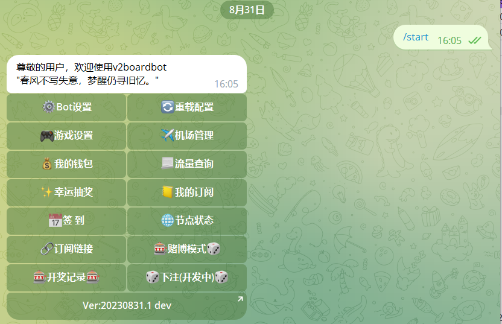
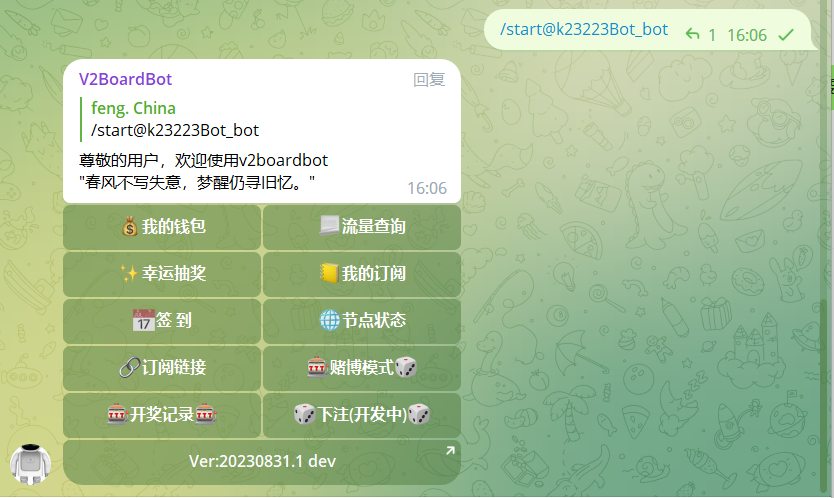
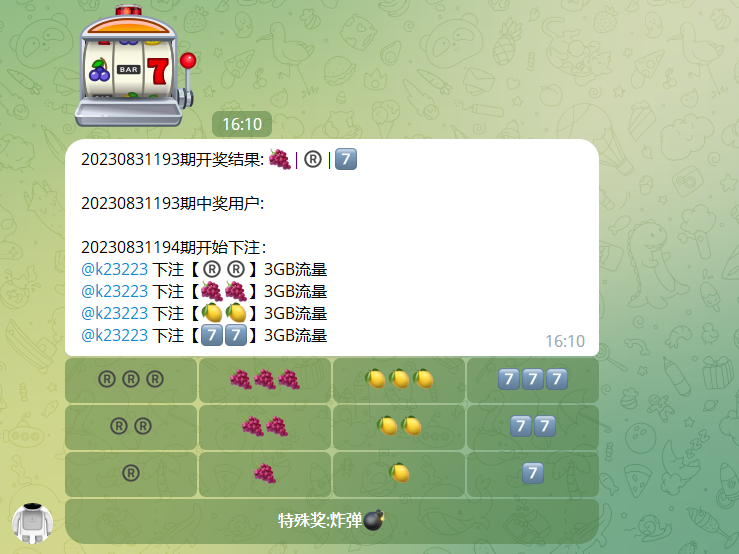

## 许可证

<p align="center">
<a rel="license" href="http://creativecommons.org/licenses/by-nc-sa/4.0/"></a><br /><span xmlns:dct="http://purl.org/dc/terms/" property="dct:title">v2boardbot</span> 由 <a xmlns:cc="http://creativecommons.org/ns#" href="https://github.com/v2boardbot/v2boardbot" property="cc:attributionName" rel="cc:attributionURL">v2boardbot</a> 采用 <a rel="license" href="http://creativecommons.org/licenses/by-nc-sa/4.0/">知识共享 署名-非商业性使用-相同方式共享 4.0 国际 许可协议</a>进行许可。<br />基于<a xmlns:dct="http://purl.org/dc/terms/" href="https://github.com/v2boardbot/v2boardbot" rel="dct:source">https://github.com/v2boardbot/v2boardbot</a>上的作品创作。
</p>


##### 声明: 本程序仅为个人学习使用，切勿用于商业用途


### 功能

- [x] 我的钱包
- [x] 流量查询
- [x] 幸运抽奖
- [x] 订阅链接
- [x] 我的订阅
- [x] 每日签到
- [x] 节点状态
- [x] 添加时长
- [x] 流量赌博
- [x] 日流量排行
- [x] 月流量排行
- [x] 老虎机群组流量游戏


## 联系我们

​		**如果有定制需求可联系个人电报，包括但不限于：数据采集、数据分析、数据标注、数据可视化、网站开发、公司官网建设、微信小程序开发、机器学习、深度学习、量化交易、毕业论文指导。**

邮箱地址：[zhuli8@protonmail.com](zhuli8@protonmail.com)

电报群组：[V2BoardBot](https://t.me/+LxVTX8H1Ca1mNDY1)

测试机器人：[@v2boarddevbot](https://t.me/v2boarddevbot)

个人电报：[@k23223](https://t.me/k23223)


## 食用

#### 机器人创建

请自行 [@BotFather](https://t.me/BotFather) 创建机器人，命令菜单如下

```text
start - 展开管理面板
bind - 绑定账号(仅限私聊)
unbind - 解除绑定
checkin - 每日签到
lucky - 幸运抽奖
wallet - 查看钱包
traffic - 查看流量
```

#### 机器人群组隐私设置

找[@BotFather](https://t.me/BotFather) 发送`/mybots` > 你的机器人 > Bot Settings > Group Privacy > Turn off

如果是Turn on就是禁用隐私设置了，不需要更改

老虎机等玩法依赖 Group Privacy ，如果 Group Privacy 为Turn off 将无法使用

#### 克隆仓库

在你需要部署的机器上克隆本项目

```bash
git clone https://github.com/v2boardbot/v2boardbot.git
```

#### 一键安装

```bash
cd v2boardbot
sh install.sh
```

安装完成会提示前台运行和后台运行，每次更新或者首次运行先前台运行，没问题以后再后台运行

#### 更新

项目更新以后在你克隆的项目目录里执行`git pull`，如果更新日志中存在本地数据库更新类似的提示，删除本地的bot.db

然后执行`sh install.sh`

#### 高级使用

如果是后台运行想要退出机器人或者重新启动机器人，运行`ps -axu|grep Bot.py`命令，也可通过该命令查看后台运行是否正常

```
[root@mycentos v2boardbot]# ps -axu|grep Bot.py
root      76614  2.9  2.2 264612 41208 pts/2    S    18:38   0:00 /root/v2boardbot/python-3.9.7/bin/python3.9 Bot.py
root      76652  0.0  0.0 112824  1000 pts/2    S+   18:39   0:00 grep --color=auto Bot.py
```

`76614`就是机器人运行的进程ID，可以使用`kill -9 76614`命令杀死机器人进程，`76614`换成你自己的进程ID

## 运行截图

### 管理端



### 用户端





## TODO

- [ ] 重置流量


## 更新记录

#### 20230831.1 dev

🟢修复若干bug

💡更新老虎机下注中奖规则

#### 20230830.1 dev

🟢感谢[cbot_for_v2board](https://github.com/caoyyds/cbot_for_v2board)提供流量游戏玩法思路

#### 20230829.2 dev

🟢修复因更新导致配置文件失效

🟢老虎机下注成功通知改为群里通知

[查看更多](version.md)

## 计划开发

可以提交issues给我们提供建议功能，提交issues请把问题和建议讲清楚

如果对该项目感兴趣，可以参与开发


## 鸣谢
- 基于Python的Telegram机器人框架[python-telegram-bot](https://github.com/python-telegram-bot/python-telegram-bot)
- 流量下注玩法参考[cbot_for_v2board](https://github.com/caoyyds/cbot_for_v2board)

## 作者有话说

**捐赠地址：**`TEqCzhQ48X8iJGYtordwbsd1HXBVYiX9Nr`

仅支持 Tron 资产(TRC10/TRC20)