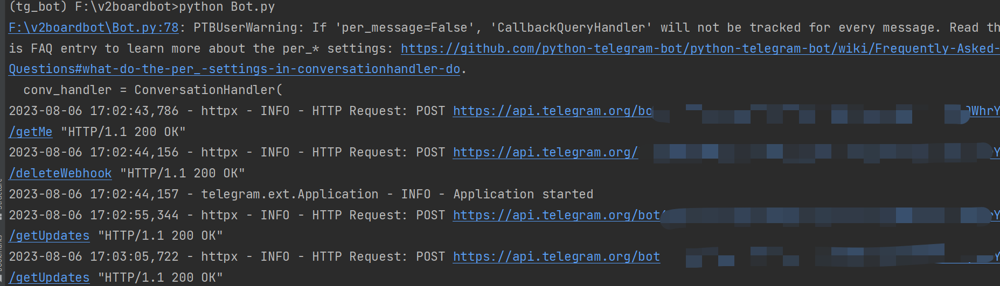

## 许可证

<p align="center">
<a rel="license" href="http://creativecommons.org/licenses/by-nc-sa/4.0/"></a><br /><span xmlns:dct="http://purl.org/dc/terms/" property="dct:title">v2boardbot</span> 由 <a xmlns:cc="http://creativecommons.org/ns#" href="https://github.com/v2boardbot/v2boardbot" property="cc:attributionName" rel="cc:attributionURL">v2boardbot</a> 采用 <a rel="license" href="http://creativecommons.org/licenses/by-nc-sa/4.0/">知识共享 署名-非商业性使用-相同方式共享 4.0 国际 许可协议</a>进行许可。<br />基于<a xmlns:dct="http://purl.org/dc/terms/" href="https://github.com/v2boardbot/v2boardbot" rel="dct:source">https://github.com/v2boardbot/v2boardbot</a>上的作品创作。
</p>


## 安装

#### 1.1克隆仓库

```bash
git clone https://github.com/v2boardbot/v2boardbot.git
```

#### 1.2 安装依赖

```bash
pip install -r requirements.txt
```

#### 1.3 说明

这是我该项目使用的依赖，可以主要就是python-telegram-bot和peewee版本对应一下即可

```python
aiomysql==0.2.0
anyio==3.7.1
asgiref==3.7.2
certifi==2023.7.22
charset-normalizer==3.2.0
databases==0.6.2
exceptiongroup==1.1.2
greenlet==2.0.2
h11==0.14.0
httpcore==0.17.3
httpx==0.24.1
idna==3.4
peewee==3.16.2
pydantic==1.10.8
PyMySQL==1.1.0
python-telegram-bot==20.4
requests==2.31.0
sniffio==1.3.0
socksio==1.0.0
SQLAlchemy==1.4.41
sqlparse==0.4.4
typing_extensions==4.7.1
tzdata==2023.3
urllib3==2.0.4
```


## 使用

### 声明: 由于还在测试阶段,数据库字段经常变化,可能随时删除重建

请自行 [@BotFather](https://t.me/BotFather) 创建机器人，命令菜单如下

```text
start - 展开管理面板
bind - 绑定账号(仅限私聊)
unbind - 解除绑定
checkin - 每日签到
lucky - 幸运抽奖
wallet - 查看钱包
traffic - 查看流量
```

按照示例填写自己的配置文件并保存为config.py,下面个人信息已脱敏处理

```python
START_ROUTES, END_ROUTES = 0, 1

DATABASE = {'charset': 'utf8', 'sql_mode': 'PIPES_AS_CONCAT', 'use_unicode': True, 'host': '172.16.1.15', 'port': 3306,
            'user': 'v2board', 'password': 'v2board'}

TOKEN = '6*85*818*7**A*PD*LNk*x*Q**nS*a**8KBPCdE*a***rY'

URL = 'http://172.16.1.15'  # 网站地址
SUFFIX = '**17*4b7'  # 网站管理员后缀 访问 http(s)://你的站点/b617f4b7 进入管理面板，你可以在用户中心修改你的密码。
EMAIL = "admin@qq.com"  # 网站管理员邮箱
PASSWORD = "***5***7fcb6*d9*b**62a5c**eeb3e1"  # 网站管理员密码

HTTP_PROXY = 'http://127.0.0.1:1082'  # 如果需要代理，则填写http代理地址，不需要代理填写None
HTTPS_PROXY = 'http://127.0.0.1:1082'  # 同上

```

先运行init_db.py来初始化机器人使用的数据库，本地sqlite数据库，不需要任何配置

```bash
python init_db.py
```

在运行Bot.py即可

```bash
python Bot.py
```




## 运行截图


## TODO

### 菜单

- [x] 我的钱包
- [x] 流量查询
- [x] 幸运抽奖
- [x] 订阅链接
- [x] 我的订阅
- [x] 签到
- [x] 节点状态

### 命令

- [x] 绑定账号
- [x] 解绑账号
- [x] 每日签到
- [x] 幸运抽奖
- [x] 查看钱包
- [x] 查看流量
- [x] 节点状态


## 更新记录

#### 20230807.2更新日志
- 添加菜单功能：订阅链接，节点状态
- 添加命令功能：节点状态

#### 20230807.1更新日志

- 添加菜单功能：我的钱包，幸运抽奖
- 添加命令功能：幸运抽奖，查看钱包，查看流量


## 计划开发

可以提交issues给我们提供建议功能，提交issues请把问题和建议讲清楚

如果对该项目感兴趣，可以参与开发，邮箱地址：zhuli8@protonmail.com


## 作者有话说

写不动了
