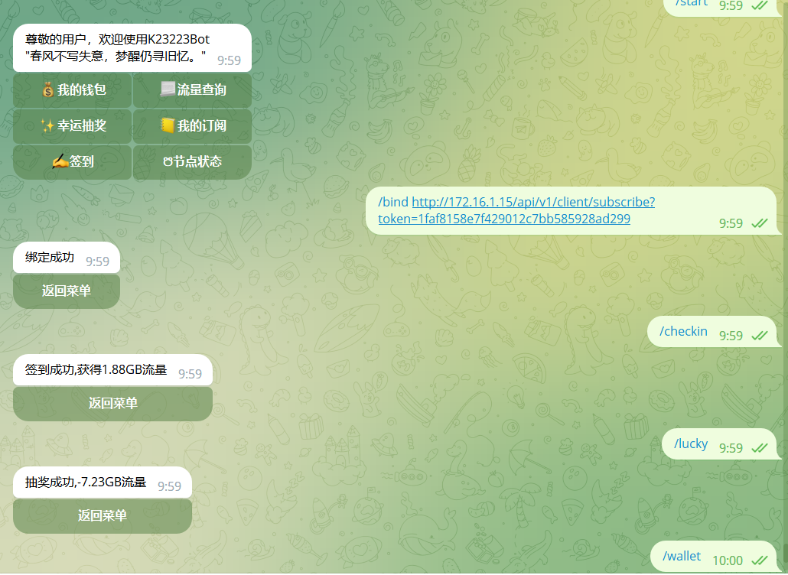
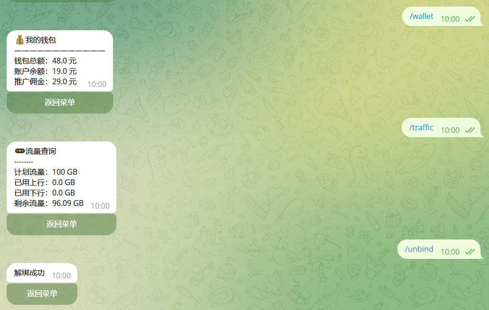
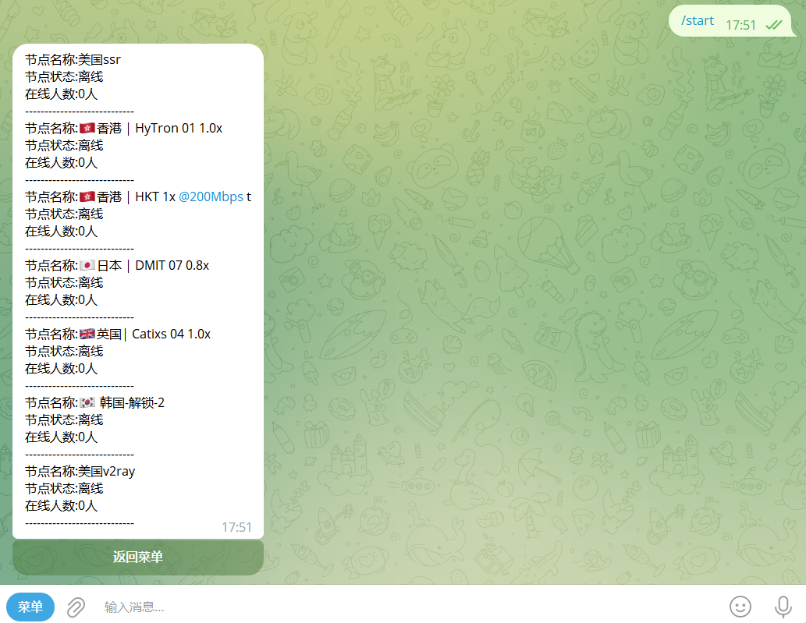
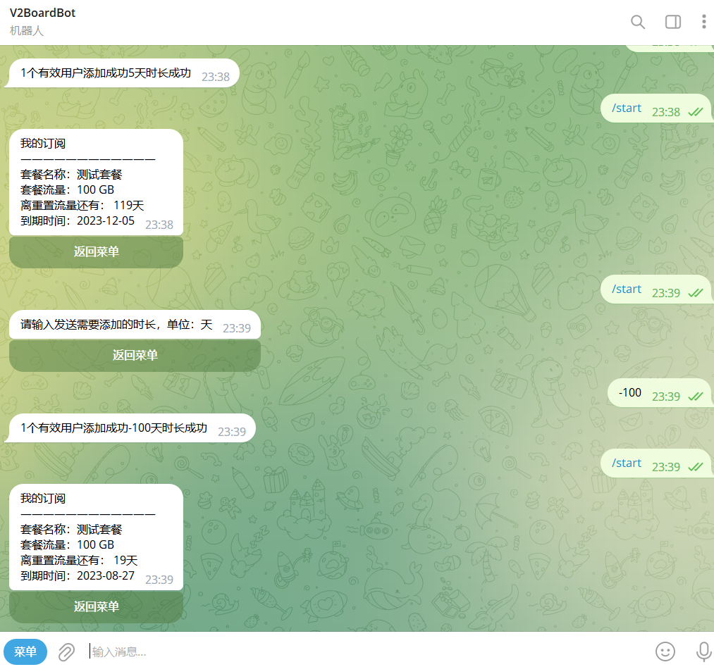

## 许可证

<p align="center">
<a rel="license" href="http://creativecommons.org/licenses/by-nc-sa/4.0/"></a><br /><span xmlns:dct="http://purl.org/dc/terms/" property="dct:title">v2boardbot</span> 由 <a xmlns:cc="http://creativecommons.org/ns#" href="https://github.com/v2boardbot/v2boardbot" property="cc:attributionName" rel="cc:attributionURL">v2boardbot</a> 采用 <a rel="license" href="http://creativecommons.org/licenses/by-nc-sa/4.0/">知识共享 署名-非商业性使用-相同方式共享 4.0 国际 许可协议</a>进行许可。<br />基于<a xmlns:dct="http://purl.org/dc/terms/" href="https://github.com/v2boardbot/v2boardbot" rel="dct:source">https://github.com/v2boardbot/v2boardbot</a>上的作品创作。
</p>


##### 声明: 由于还在测试阶段,数据库字段经常变化,可能随时删除重建


## 联系我们

邮箱地址：[zhuli8@protonmail.com](zhuli8@protonmail.com)

电报群组：[k2323Bot测试群](https://t.me/+LxVTX8H1Ca1mNDY1)

个人电报：[@k23223](https://t.me/k23223)

## 食用

#### 机器人创建

请自行 [@BotFather](https://t.me/BotFather) 创建机器人，命令菜单如下

```text
start - 展开管理面板
bind - 绑定账号(仅限私聊)
unbind - 解除绑定
checkin - 每日签到
lucky - 幸运抽奖
wallet - 查看钱包
traffic - 查看流量
```

#### 机器人群组隐私设置

找[@BotFather](https://t.me/BotFather) 发送`/mybots` > 你的机器人 > Bot Settings > Group Privacy > Turn off

如果是Turn on就是禁用隐私设置了，不需要更改

老虎机等玩法依赖 Group Privacy ，如果 Group Privacy 为Turn off 将无法使用

#### 克隆仓库

在你需要部署的机器上克隆本项目

```bash
git clone -b dev https://github.com/v2boardbot/v2boardbot.git
```

#### 一键安装

```bash
cd v2boardbot
sh install.sh
```

#### 更新

项目更新以后在你克隆的项目目录里执行`git pull`，如果更新日志中存在本地数据库更新类似的提示，删除本地的bot.db

## 运行截图










## TODO

- [ ] 增加赌博模式自定义下注
- [ ] 添加骰子自定义开关
- [ ] 添加自定义签到流量区间
- [ ] 添加自定义抽奖流量区间

### 菜单

- [x] 我的钱包
- [x] 流量查询
- [x] 幸运抽奖
- [x] 订阅链接
- [x] 我的订阅
- [x] 签到
- [x] 节点状态
- [x] 添加时长
- [ ] 重置流量
- [x] 老虎机
- [ ] 日流量排行
- [ ] 月流量排行

### 命令

- [x] 绑定账号
- [x] 解绑账号
- [x] 每日签到
- [x] 幸运抽奖
- [x] 查看钱包
- [x] 查看流量


## 更新记录

#### 20230810.3 dev

- 修复若干bug
- 修复解绑重新绑定可重新签到
- 代码优化

#### 20230810.2 dev

- 支持centos、ubuntu、debian一键部署
- 优化配置文件设置
- 修复在群组直接展示订阅链接
- 修改配置文件为yaml

#### 20230809.1

- 修复赌博机重大bug
- 增加赌博筛子玩法
- 修复幸运抽奖未订阅可抽奖
- 自定义菜单欢迎词

#### 20230808.4

- 日常修复若干bug
- 优化菜单图标
- 优化部署教程
- 增加老虎机玩法

#### 20230808.3

- 日常修复若干bug

#### 20230808.2

- 修改若干bug，优化部署教程
- 修改机器人数据库初始化为自动初始化

#### 20230808.1

- 添加隐藏命令/myid，发送该命令可以获取telegram_id
- 添加管理员一键增加所有订阅用户的时长(不限时套餐除外)

#### 20230807.2
- 添加菜单功能：订阅链接，节点状态
- 添加命令功能：节点状态

#### 20230807.1

- 添加菜单功能：我的钱包，幸运抽奖
- 添加命令功能：幸运抽奖，查看钱包，查看流量


## 计划开发

可以提交issues给我们提供建议功能，提交issues请把问题和建议讲清楚

如果对该项目感兴趣，可以参与开发


## 作者有话说

**本项目赞助机场: [Kitty Network](http://kitty.skin/)**